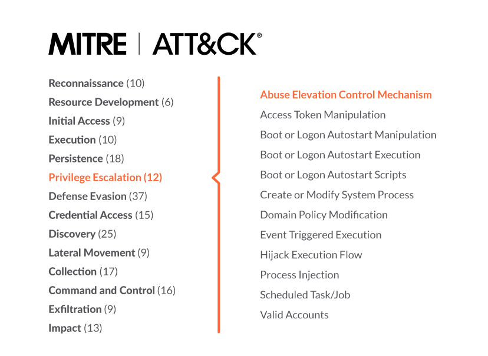

## Post-Exploit

	- Escaladade Privilegios
		- Manipulación de Tokens
		- Secuestro DLL
		- 
	- Credenciales
		- Mmikatz
		- Volcar SAM, LSA
		-
	- Movimiento Lateral
		- Tunelización
		- Reenvio de puertos
		-
	- Persistencia
		- Tareas Programadas
		- Crear Cuenta
		- Crear un servicio
		

## Frameworks C-2

	- Metasploit		
	- Atomic Red Team
	- Empire	
	- Powersploit
	- Covenant
	- Pupy

## Escalada de Privilegios Herramientas

	Aprovechar vulnerabilidades del sistema como archivos o servicios mal configurados para poder ejecutar scripts o exploits con privilegios de superusuario.

	- Limpeas
	- Windows/Linux Exploit suggester
	- Mimikatz
	- LinEnum
	- GTFObins

[MITRE Priv Escal](https://attack.mitre.org/tactics/TA0004/)

[iREd](https://www.ired.team/offensive-security/privilege-escalation)

[EMPIRE](https://www.hackingarticles.in/hacking-with-empire-powershell-post-exploitation-agent/) / [EMPIRE](https://bc-security.gitbook.io/empire-wiki/)

[COVENANT](https://www.hackingarticles.in/covenant-for-pentester-basics/) / [COVENANT](https://github.com/cobbr/Covenant/wiki)

[METASPLOIT](https://github.com/security-cheatsheet/metasploit-cheat-sheet) / [METASPLOIT](https://www.offensive-security.com/metasploit-unleashed/)

[PUPY](https://www.hackingarticles.in/command-control-tool-pupy/) / [PUPY](https://ptestmethod.readthedocs.io/en/latest/pupy.html#all-platforms)

[Atomic Red Team](https://github.com/redcanaryco/atomic-red-team)

